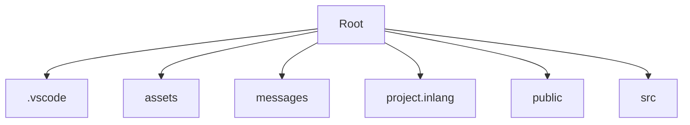

## 🛠️ Compétences IA Actives
* **Skill React/NodeJS** : Activé pour l'analyse structurelle.

# 🧠 Code Wiki : f_mindfullness
Généré le : 23 Feb 2026
Type : directory
---
## 🗺️ Architecture Visuelle


## 🔍 Aperçu du Contenu
Top 10 fichiers/dossiers :
    /d/Git_fileordoc/f_mindfullness:
    assets
    components.json
    eslint.config.js
    GEMINI.md
    messages
    package.json
    package-lock.json
    prettier.config.js
    project.inlang
    public
    README.md

## 🤖 Aide Agentique
Utilisez 'git-library chat /d/Git_fileordoc/f_mindfullness' pour poser des questions sur ce code.
## 🛠️ Compétences IA Actives
* **Skill React/NodeJS** : Activé pour l'analyse structurelle.

# 🧠 Code Wiki : f_mindfullness
Généré le : 23 Feb 2026
Type : directory
---
## 🗺️ Architecture Visuelle


## 🔍 Aperçu du Contenu
Top 10 fichiers/dossiers :
    /d/Git_fileordoc/f_mindfullness:
    assets
    components.json
    eslint.config.js
    GEMINI.md
    messages
    package.json
    package-lock.json
    prettier.config.js
    project.inlang
    public
    README.md

## 🤖 Aide Agentique
Utilisez 'git-library chat /d/Git_fileordoc/f_mindfullness' pour poser des questions sur ce code.
# 🧠 Code Wiki : f_mindfullness
Généré le : 23 Feb 2026
Type : directory
---
## 🗺️ Architecture Visuelle


## 🔍 Aperçu du Contenu
Top 10 fichiers/dossiers :
    /d/Git_fileordoc/f_mindfullness:
    assets
    components.json
    eslint.config.js
    GEMINI.md
    messages
    package.json
    package-lock.json
    prettier.config.js
    project.inlang
    public
    README.md


## 🩺 Symboles Chirurgicaux
```text
🩺 Dissection des symboles dans : /d/Git_fileordoc/f_mindfullness...
/d/Git_fileordoc/f_mindfullness/README.md:function App() {
/d/Git_fileordoc/f_mindfullness/README.md:We use the `Derived` class to create a new store that is derived from another store. The `Derived` class has a `mount` method that will start the derived store updating.
/d/Git_fileordoc/f_mindfullness/src/components/faq-tabs.tsx:export function FaqsSection() {
/d/Git_fileordoc/f_mindfullness/src/components/final-cta.tsx:export function FinalCTA() {
/d/Git_fileordoc/f_mindfullness/src/components/formations/formations-list.tsx:export function FormationsList() {
/d/Git_fileordoc/f_mindfullness/src/components/header.tsx:export function Header() {
/d/Git_fileordoc/f_mindfullness/src/components/hero.tsx:function Hero() {
/d/Git_fileordoc/f_mindfullness/src/components/LocaleSwitcher.tsx:export default function ParaglideLocaleSwitcher() {
/d/Git_fileordoc/f_mindfullness/src/components/menu-toggle-icon.tsx:export function MenuToggleIcon({
/d/Git_fileordoc/f_mindfullness/src/components/mode-toggle.tsx:export function ModeToggle() {
/d/Git_fileordoc/f_mindfullness/src/components/optics/card.jsx:function Card({
/d/Git_fileordoc/f_mindfullness/src/components/optics/card.jsx:function CardAction({ className, ...props }) {
/d/Git_fileordoc/f_mindfullness/src/components/optics/card.jsx:function CardContent({ className, ...props }) {
/d/Git_fileordoc/f_mindfullness/src/components/optics/card.jsx:function CardDescription({ className, ...props }) {
/d/Git_fileordoc/f_mindfullness/src/components/optics/card.jsx:function CardFooter({ className, background = false, children, ...props }) {
/d/Git_fileordoc/f_mindfullness/src/components/optics/card.jsx:function CardHeader({ className, ...props }) {
/d/Git_fileordoc/f_mindfullness/src/components/optics/card.jsx:function CardTitle({ className, ...props }) {
FormationDetailProps) {
```
## 🤖 Aide Agentique
Utilisez 'git-library chat /d/Git_fileordoc/f_mindfullness' pour poser des questions sur ce code.
# 🧠 Code Wiki : f_mindfullness
Généré le : 23 Feb 2026
Type : directory
---
## 🗺️ Architecture Visuelle


## 🔍 Aperçu du Contenu
Top 10 fichiers/dossiers :
    /d/Git_fileordoc/f_mindfullness:
    assets
    components.json
    eslint.config.js
    GEMINI.json
    GEMINI.md
    messages
    package.json
    package-lock.json
    prettier.config.js
    project.inlang
    public


## 🩺 Symboles Chirurgicaux
```text
🩺 Dissection des symboles dans : /d/Git_fileordoc/f_mindfullness...
/d/Git_fileordoc/f_mindfullness/README.md:function App() {
/d/Git_fileordoc/f_mindfullness/README.md:We use the `Derived` class to create a new store that is derived from another store. The `Derived` class has a `mount` method that will start the derived store updating.
/d/Git_fileordoc/f_mindfullness/src/components/faq-tabs.tsx:export function FaqsSection() {
/d/Git_fileordoc/f_mindfullness/src/components/final-cta.tsx:export function FinalCTA() {
/d/Git_fileordoc/f_mindfullness/src/components/formations/formations-list.tsx:export function FormationsList() {
/d/Git_fileordoc/f_mindfullness/src/components/header.tsx:export function Header() {
/d/Git_fileordoc/f_mindfullness/src/components/hero.tsx:function Hero() {
/d/Git_fileordoc/f_mindfullness/src/components/LocaleSwitcher.tsx:export default function ParaglideLocaleSwitcher() {
/d/Git_fileordoc/f_mindfullness/src/components/menu-toggle-icon.tsx:export function MenuToggleIcon({
/d/Git_fileordoc/f_mindfullness/src/components/mode-toggle.tsx:export function ModeToggle() {
/d/Git_fileordoc/f_mindfullness/src/components/optics/card.jsx:function Card({
/d/Git_fileordoc/f_mindfullness/src/components/optics/card.jsx:function CardAction({ className, ...props }) {
/d/Git_fileordoc/f_mindfullness/src/components/optics/card.jsx:function CardContent({ className, ...props }) {
/d/Git_fileordoc/f_mindfullness/src/components/optics/card.jsx:function CardDescription({ className, ...props }) {
/d/Git_fileordoc/f_mindfullness/src/components/optics/card.jsx:function CardFooter({ className, background = false, children, ...props }) {
/d/Git_fileordoc/f_mindfullness/src/components/optics/card.jsx:function CardHeader({ className, ...props }) {
/d/Git_fileordoc/f_mindfullness/src/components/optics/card.jsx:function CardTitle({ className, ...props }) {
FormationDetailProps) {
```
## 🤖 Aide Agentique
Utilisez 'git-library chat /d/Git_fileordoc/f_mindfullness' pour poser des questions sur ce code.
