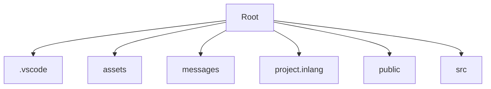

## 🛠️ Compétences IA Actives
* **Skill React/NodeJS** : Activé pour l'analyse structurelle.

# 🧠 Code Wiki : f_mindfullness
Généré le : 23 Feb 2026
Type : directory
---
## 🗺️ Architecture Visuelle


## 🔍 Aperçu du Contenu
Top 10 fichiers/dossiers :
    /d/Git_fileordoc/f_mindfullness:
    assets
    components.json
    eslint.config.js
    GEMINI.md
    messages
    package.json
    package-lock.json
    prettier.config.js
    project.inlang
    public
    README.md

## 🤖 Aide Agentique
Utilisez 'git-library chat /d/Git_fileordoc/f_mindfullness' pour poser des questions sur ce code.
## 🛠️ Compétences IA Actives
* **Skill React/NodeJS** : Activé pour l'analyse structurelle.

# 🧠 Code Wiki : f_mindfullness
Généré le : 23 Feb 2026
Type : directory
---
## 🗺️ Architecture Visuelle


## 🔍 Aperçu du Contenu
Top 10 fichiers/dossiers :
    /d/Git_fileordoc/f_mindfullness:
    assets
    components.json
    eslint.config.js
    GEMINI.md
    messages
    package.json
    package-lock.json
    prettier.config.js
    project.inlang
    public
    README.md

## 🤖 Aide Agentique
Utilisez 'git-library chat /d/Git_fileordoc/f_mindfullness' pour poser des questions sur ce code.
# 🧠 Code Wiki : f_mindfullness
Généré le : 23 Feb 2026
Type : directory
---
## 🗺️ Architecture Visuelle


## 🔍 Aperçu du Contenu
Top 10 fichiers/dossiers :
    /d/Git_fileordoc/f_mindfullness:
    assets
    components.json
    eslint.config.js
    GEMINI.md
    messages
    package.json
    package-lock.json
    prettier.config.js
    project.inlang
    public
    README.md


## 🩺 Symboles Chirurgicaux
```text
🩺 Dissection des symboles dans : /d/Git_fileordoc/f_mindfullness...
/d/Git_fileordoc/f_mindfullness/README.md:function App() {
/d/Git_fileordoc/f_mindfullness/README.md:We use the `Derived` class to create a new store that is derived from another store. The `Derived` class has a `mount` method that will start the derived store updating.
/d/Git_fileordoc/f_mindfullness/src/components/faq-tabs.tsx:export function FaqsSection() {
/d/Git_fileordoc/f_mindfullness/src/components/final-cta.tsx:export function FinalCTA() {
/d/Git_fileordoc/f_mindfullness/src/components/formations/formations-list.tsx:export function FormationsList() {
/d/Git_fileordoc/f_mindfullness/src/components/header.tsx:export function Header() {
/d/Git_fileordoc/f_mindfullness/src/components/hero.tsx:function Hero() {
/d/Git_fileordoc/f_mindfullness/src/components/LocaleSwitcher.tsx:export default function ParaglideLocaleSwitcher() {
/d/Git_fileordoc/f_mindfullness/src/components/menu-toggle-icon.tsx:export function MenuToggleIcon({
/d/Git_fileordoc/f_mindfullness/src/components/mode-toggle.tsx:export function ModeToggle() {
/d/Git_fileordoc/f_mindfullness/src/components/optics/card.jsx:function Card({
/d/Git_fileordoc/f_mindfullness/src/components/optics/card.jsx:function CardAction({ className, ...props }) {
/d/Git_fileordoc/f_mindfullness/src/components/optics/card.jsx:function CardContent({ className, ...props }) {
/d/Git_fileordoc/f_mindfullness/src/components/optics/card.jsx:function CardDescription({ className, ...props }) {
/d/Git_fileordoc/f_mindfullness/src/components/optics/card.jsx:function CardFooter({ className, background = false, children, ...props }) {
/d/Git_fileordoc/f_mindfullness/src/components/optics/card.jsx:function CardHeader({ className, ...props }) {
/d/Git_fileordoc/f_mindfullness/src/components/optics/card.jsx:function CardTitle({ className, ...props }) {
FormationDetailProps) {
```
## 🤖 Aide Agentique
Utilisez 'git-library chat /d/Git_fileordoc/f_mindfullness' pour poser des questions sur ce code.
# 🧠 Code Wiki : f_mindfullness
Généré le : 23 Feb 2026
Type : directory
---
## 🗺️ Architecture Visuelle


## 🔍 Aperçu du Contenu
Top 10 fichiers/dossiers :
    /d/Git_fileordoc/f_mindfullness:
    assets
    components.json
    eslint.config.js
    GEMINI.json
    GEMINI.md
    messages
    package.json
    package-lock.json
    prettier.config.js
    project.inlang
    public


## 🩺 Symboles Chirurgicaux
```text
🩺 Dissection des symboles dans : /d/Git_fileordoc/f_mindfullness...
/d/Git_fileordoc/f_mindfullness/README.md:function App() {
/d/Git_fileordoc/f_mindfullness/README.md:We use the `Derived` class to create a new store that is derived from another store. The `Derived` class has a `mount` method that will start the derived store updating.
/d/Git_fileordoc/f_mindfullness/src/components/faq-tabs.tsx:export function FaqsSection() {
/d/Git_fileordoc/f_mindfullness/src/components/final-cta.tsx:export function FinalCTA() {
/d/Git_fileordoc/f_mindfullness/src/components/formations/formations-list.tsx:export function FormationsList() {
/d/Git_fileordoc/f_mindfullness/src/components/header.tsx:export function Header() {
/d/Git_fileordoc/f_mindfullness/src/components/hero.tsx:function Hero() {
/d/Git_fileordoc/f_mindfullness/src/components/LocaleSwitcher.tsx:export default function ParaglideLocaleSwitcher() {
/d/Git_fileordoc/f_mindfullness/src/components/menu-toggle-icon.tsx:export function MenuToggleIcon({
/d/Git_fileordoc/f_mindfullness/src/components/mode-toggle.tsx:export function ModeToggle() {
/d/Git_fileordoc/f_mindfullness/src/components/optics/card.jsx:function Card({
/d/Git_fileordoc/f_mindfullness/src/components/optics/card.jsx:function CardAction({ className, ...props }) {
/d/Git_fileordoc/f_mindfullness/src/components/optics/card.jsx:function CardContent({ className, ...props }) {
/d/Git_fileordoc/f_mindfullness/src/components/optics/card.jsx:function CardDescription({ className, ...props }) {
/d/Git_fileordoc/f_mindfullness/src/components/optics/card.jsx:function CardFooter({ className, background = false, children, ...props }) {
/d/Git_fileordoc/f_mindfullness/src/components/optics/card.jsx:function CardHeader({ className, ...props }) {
/d/Git_fileordoc/f_mindfullness/src/components/optics/card.jsx:function CardTitle({ className, ...props }) {
FormationDetailProps) {
```
## 🤖 Aide Agentique
Utilisez 'git-library chat /d/Git_fileordoc/f_mindfullness' pour poser des questions sur ce code.
# 🧠 Code Wiki : f_mindfullness
Généré le : 23 Feb 2026
Type : directory
---
## 🗺️ Architecture Visuelle


## 📂 Structure du Projet
    /d/Git_fileordoc/f_mindfullness
    README.md
    assets
    assets/Inner Harmony_ Herbal Meditation Rituals.jpg
    assets/hero-image.png
    assets/logo-typo.png
    assets/logo.png
    assets/image1.png
    components.json
    eslint.config.js
    messages
    messages/de.json
    messages/en.json
    package-lock.json
    package.json
    project.inlang
    project.inlang/settings.json
    public
    public/favicon.ico
    public/logo192.png
    public/logo512.png
    public/manifest.json
    public/robots.txt
    public/tanstack-circle-logo.png
    public/tanstack-word-logo-white.svg
    src
    src/components
    src/components/LocaleSwitcher.tsx
    src/components/about-section.tsx
    src/components/animated-tooltip.tsx
    src/components/faq-tabs.tsx
    src/components/features-section.tsx
    src/components/final-cta.tsx
    src/components/formations-grid.tsx
    src/components/formations
    src/components/header.tsx
    src/components/hero.tsx
    src/components/menu-toggle-icon.tsx
    src/components/mode-toggle.tsx
    src/components/modem-animated-footer.tsx
    src/components/optics
    src/components/scroll-banner.tsx
    src/components/studio-gallery.tsx
    src/components/testimonials-column.tsx
    src/components/testimonials.tsx
    src/components/theme-provider.tsx
    src/components/ui
    src/components/use-scroll.tsx
    src/data
    src/data/demo.punk-songs.ts
    src/integrations
    src/integrations/tanstack-query
    src/lib
    src/lib/utils.js
    src/lib/utils.ts
    src/logo.svg
    src/routeTree.gen.ts
    src/router.tsx
    src/routes
    src/routes/__root.tsx
    src/routes/_layout
    src/routes/demo.i18n.tsx
    src/routes/demo
    src/server.ts
    src/styles.css
    tsconfig.json
    vite.config.ts
    prettier.config.js
    GEMINI.md
    GEMINI.json

## 🎓 Academy & Tutoriels
Un parcours d'apprentissage est disponible pour ce projet.
- [Voir l'Academy](../git-library/vault/f_mindfullness/2026-02-23_20-01/academy/ACADEMY.md)

## 🩺 Symboles Chirurgicaux (Classes & Fonctions)
```text
🩺 Dissection des symboles dans : /d/Git_fileordoc/f_mindfullness...
"🕸️ Mapping des dépendances... /d/Git_fileordoc/f_mindfullness/eslint.config.js:import { tanstackConfig } from '@tanstack/eslint-config' /d/Git_fileordoc/f_mindfullness/README.md:import { Link } from "@tanstack/react-router"; /d/Git_fileordoc/f_mindfullness/README.md:import { Outlet, createRootRoute } from '@tanstack/react-router' /d/Git_fileordoc/f_mindfullness/README.md:import { QueryClient, QueryClientProvider } from "@tanstack/react-query"; /d/Git_fileordoc/f_mindfullness/README.md:import { ReactQueryDevtools } from "@tanstack/react-query-devtools"; /d/Git_fileordoc/f_mindfullness/README.md:import { Store } from "@tanstack/store"; /d/Git_fileordoc/f_mindfullness/README.md:import { Store, Derived } from "@tanstack/store"; /d/Git_fileordoc/f_mindfullness/README.md:import { TanStackRouterDevtools } from '@tanstack/react-router-devtools' /d/Git_fileordoc/f_mindfullness/README.md:import { useQuery } from "@tanstack/react-query"; /d/Git_fileordoc/f_mindfullness/README.md:import { useStore } from "@tanstack/react-store"; /d/Git_fileordoc/f_mindfullness/README.md:To use SPA (Single Page Application) navigation you will need to import the `Link` component from `@tanstack/react-router`. /d/Git_fileordoc/f_mindfullness/src/components/LocaleSwitcher.tsx:import { getLocale, locales, setLocale } from '@/paraglide/runtime' /d/Git_fileordoc/f_mindfullness/src/components/LocaleSwitcher.tsx:import { m } from '@/paraglide/messages' "}
/d/Git_fileordoc/f_mindfullness/GEMINI.md:/d/Git_fileordoc/f_mindfullness/README.md:function App() {
/d/Git_fileordoc/f_mindfullness/GEMINI.md:/d/Git_fileordoc/f_mindfullness/README.md:We use the `Derived` class to create a new store that is derived from another store. The `Derived` class has a `mount` method that will start the derived store updating.
/d/Git_fileordoc/f_mindfullness/GEMINI.md:/d/Git_fileordoc/f_mindfullness/src/components/faq-tabs.tsx:export function FaqsSection() {
/d/Git_fileordoc/f_mindfullness/GEMINI.md:/d/Git_fileordoc/f_mindfullness/src/components/final-cta.tsx:export function FinalCTA() {
/d/Git_fileordoc/f_mindfullness/GEMINI.md:/d/Git_fileordoc/f_mindfullness/src/components/formations/formations-list.tsx:export function FormationsList() {
/d/Git_fileordoc/f_mindfullness/GEMINI.md:/d/Git_fileordoc/f_mindfullness/src/components/header.tsx:export function Header() {
/d/Git_fileordoc/f_mindfullness/GEMINI.md:/d/Git_fileordoc/f_mindfullness/src/components/hero.tsx:function Hero() {
/d/Git_fileordoc/f_mindfullness/GEMINI.md:/d/Git_fileordoc/f_mindfullness/src/components/LocaleSwitcher.tsx:export default function ParaglideLocaleSwitcher() {
/d/Git_fileordoc/f_mindfullness/GEMINI.md:/d/Git_fileordoc/f_mindfullness/src/components/menu-toggle-icon.tsx:export function MenuToggleIcon({
/d/Git_fileordoc/f_mindfullness/GEMINI.md:/d/Git_fileordoc/f_mindfullness/src/components/mode-toggle.tsx:export function ModeToggle() {
/d/Git_fileordoc/f_mindfullness/GEMINI.md:/d/Git_fileordoc/f_mindfullness/src/components/optics/card.jsx:function Card({
/d/Git_fileordoc/f_mindfullness/GEMINI.md:/d/Git_fileordoc/f_mindfullness/src/components/optics/card.jsx:function CardAction({ className, ...props }) {
/d/Git_fileordoc/f_mindfullness/GEMINI.md:/d/Git_fileordoc/f_mindfullness/src/components/optics/card.jsx:function CardContent({ className, ...props }) {
/d/Git_fileordoc/f_mindfullness/GEMINI.md:/d/Git_fileordoc/f_mindfullness/src/components/optics/card.jsx:function CardDescription({ className, ...props }) {
/d/Git_fileordoc/f_mindfullness/GEMINI.md:/d/Git_fileordoc/f_mindfullness/src/components/optics/card.jsx:function CardFooter({ className, background = false, children, ...props }) {
/d/Git_fileordoc/f_mindfullness/GEMINI.md:/d/Git_fileordoc/f_mindfullness/src/components/optics/card.jsx:function CardHeader({ className, ...props }) {
/d/Git_fileordoc/f_mindfullness/GEMINI.md:/d/Git_fileordoc/f_mindfullness/src/components/optics/card.jsx:function CardTitle({ className, ...props }) {
/d/Git_fileordoc/f_mindfullness/README.md:function App() {
/d/Git_fileordoc/f_mindfullness/README.md:We use the `Derived` class to create a new store that is derived from another store. The `Derived` class has a `mount` method that will start the derived store updating.
/d/Git_fileordoc/f_mindfullness/src/components/faq-tabs.tsx:export function FaqsSection() {
/d/Git_fileordoc/f_mindfullness/src/components/final-cta.tsx:export function FinalCTA() {
/d/Git_fileordoc/f_mindfullness/src/components/formations/formations-list.tsx:export function FormationsList() {
/d/Git_fileordoc/f_mindfullness/src/components/header.tsx:export function Header() {
/d/Git_fileordoc/f_mindfullness/src/components/hero.tsx:function Hero() {
/d/Git_fileordoc/f_mindfullness/src/components/LocaleSwitcher.tsx:export default function ParaglideLocaleSwitcher() {
/d/Git_fileordoc/f_mindfullness/src/components/menu-toggle-icon.tsx:export function MenuToggleIcon({
/d/Git_fileordoc/f_mindfullness/src/components/mode-toggle.tsx:export function ModeToggle() {
/d/Git_fileordoc/f_mindfullness/src/components/optics/card.jsx:function Card({
/d/Git_fileordoc/f_mindfullness/src/components/optics/card.jsx:function CardAction({ className, ...props }) {
/d/Git_fileordoc/f_mindfullness/src/components/optics/card.jsx:function CardContent({ className, ...props }) {
/d/Git_fileordoc/f_mindfullness/src/components/optics/card.jsx:function CardDescription({ className, ...props }) {
/d/Git_fileordoc/f_mindfullness/src/components/optics/card.jsx:function CardFooter({ className, background = false, children, ...props }) {
/d/Git_fileordoc/f_mindfullness/src/components/optics/card.jsx:function CardHeader({ className, ...props }) {
/d/Git_fileordoc/f_mindfullness/src/components/optics/card.jsx:function CardTitle({ className, ...props }) {
/d/Git_fileordoc/f_mindfullness/src/components/theme-provider.tsx:export function ThemeProvider({
/d/Git_fileordoc/f_mindfullness/src/components/ui/dropdown-menu.tsx:function DropdownMenu({
/d/Git_fileordoc/f_mindfullness/src/components/ui/dropdown-menu.tsx:function DropdownMenuCheckboxItem({
/d/Git_fileordoc/f_mindfullness/src/components/ui/dropdown-menu.tsx:function DropdownMenuContent({
/d/Git_fileordoc/f_mindfullness/src/components/ui/dropdown-menu.tsx:function DropdownMenuGroup({
/d/Git_fileordoc/f_mindfullness/src/components/ui/dropdown-menu.tsx:function DropdownMenuItem({
/d/Git_fileordoc/f_mindfullness/src/components/ui/dropdown-menu.tsx:function DropdownMenuLabel({
/d/Git_fileordoc/f_mindfullness/src/components/ui/dropdown-menu.tsx:function DropdownMenuPortal({
/d/Git_fileordoc/f_mindfullness/src/components/ui/dropdown-menu.tsx:function DropdownMenuRadioGroup({
/d/Git_fileordoc/f_mindfullness/src/components/ui/dropdown-menu.tsx:function DropdownMenuRadioItem({
/d/Git_fileordoc/f_mindfullness/src/components/ui/dropdown-menu.tsx:function DropdownMenuSeparator({
/d/Git_fileordoc/f_mindfullness/src/components/ui/dropdown-menu.tsx:function DropdownMenuShortcut({
/d/Git_fileordoc/f_mindfullness/src/components/ui/dropdown-menu.tsx:function DropdownMenuSub({
/d/Git_fileordoc/f_mindfullness/src/components/ui/dropdown-menu.tsx:function DropdownMenuSubContent({
/d/Git_fileordoc/f_mindfullness/src/components/ui/dropdown-menu.tsx:function DropdownMenuSubTrigger({
/d/Git_fileordoc/f_mindfullness/src/components/ui/dropdown-menu.tsx:function DropdownMenuTrigger({
/d/Git_fileordoc/f_mindfullness/src/integrations/tanstack-query/root-provider.tsx:export function getContext() {
/d/Git_fileordoc/f_mindfullness/src/integrations/tanstack-query/root-provider.tsx:export function Provider({
/d/Git_fileordoc/f_mindfullness/src/lib/utils.js:export function cn(...inputs) {
/d/Git_fileordoc/f_mindfullness/src/routes/_layout/formations/$formationId.tsx:function FormationDetailPage() {
/d/Git_fileordoc/f_mindfullness/src/routes/_layout/formations/index.tsx:function FormationsPage() {
/d/Git_fileordoc/f_mindfullness/src/routes/_layout/index.tsx:function App() {
/d/Git_fileordoc/f_mindfullness/src/routes/_layout/route.tsx:function RouteComponent() {
/d/Git_fileordoc/f_mindfullness/src/routes/demo.i18n.tsx:function App() {
/d/Git_fileordoc/f_mindfullness/src/routes/demo/start.api-request.tsx:function getNames() {
/d/Git_fileordoc/f_mindfullness/src/routes/demo/start.api-request.tsx:function Home() {
/d/Git_fileordoc/f_mindfullness/src/routes/demo/start.server-funcs.tsx:async function readTodos() {
/d/Git_fileordoc/f_mindfullness/src/routes/demo/start.server-funcs.tsx:function Home() {
/d/Git_fileordoc/f_mindfullness/src/routes/demo/start.ssr.data-only.tsx:function RouteComponent() {
/d/Git_fileordoc/f_mindfullness/src/routes/demo/start.ssr.full-ssr.tsx:function RouteComponent() {
/d/Git_fileordoc/f_mindfullness/src/routes/demo/start.ssr.index.tsx:function RouteComponent() {
/d/Git_fileordoc/f_mindfullness/src/routes/demo/start.ssr.spa-mode.tsx:function RouteComponent() {
/d/Git_fileordoc/f_mindfullness/src/routes/demo/tanstack-query.tsx:function TanStackQueryDemo() {
BadgeProps) {
ClassValue[]) {
FormationDetailProps) {
number) {
React.ComponentProps<"div">) {
React.ComponentProps<"input">) {
React.ReactNode }) {
```
## 🤖 Aide Agentique
Utilisez 'git-library chat /d/Git_fileordoc/f_mindfullness' pour poser des questions sur ce code.
