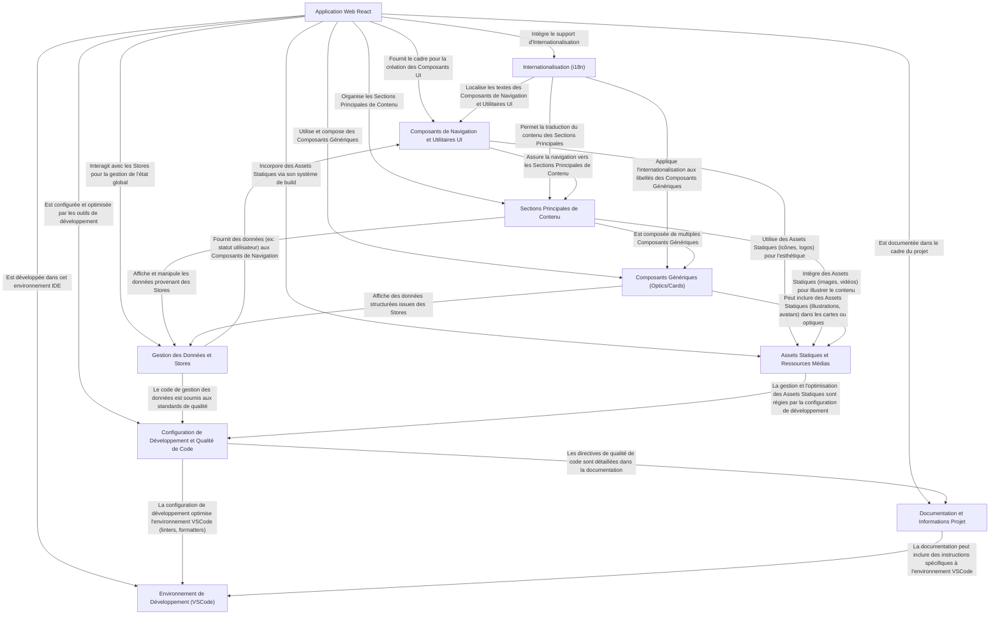

# 🎓 Academy : f_mindfullness

Ce projet est une application web moderne construite avec React (0), axée sur une expérience utilisateur riche et internationale. L'architecture est modulaire, s'appuyant sur des composants UI réutilisables (2, 4) pour structurer le contenu (3) et assurer une navigation fluide. La gestion des données (5) est centralisée pour alimenter ces composants de manière dynamique. L'application est conçue pour être multilingue grâce à l'internationalisation (1), et incorpore des ressources statiques (6) pour les visuels. Un accent est mis sur la qualité de code et la configuration de développement (7), avec une documentation claire (8) et un environnement de développement optimisé (9), garantissant maintenabilité et scalabilité.

## 🏗️ Architecture des Concepts

## 📖 Sommaire
- [Environnement de Développement (VSCode)](./chapter_01_environnement_de_développement__vscode_.md)
- [Application Web React](./chapter_02_application_web_react.md)
- [Assets Statiques et Ressources Médias](./chapter_03_assets_statiques_et_ressources_médias.md)
- [Composants de Navigation et Utilitaires UI](./chapter_04_composants_de_navigation_et_utilitaires_ui.md)
- [Sections Principales de Contenu](./chapter_05_sections_principales_de_contenu.md)
- [Gestion des Données et Stores](./chapter_06_gestion_des_données_et_stores.md)
- [Composants Génériques (Optics/Cards)](./chapter_07_composants_génériques__optics_cards_.md)
- [Internationalisation (i18n)](./chapter_08_internationalisation__i18n_.md)
- [Configuration de Développement et Qualité de Code](./chapter_09_configuration_de_développement_et_qualité_de_code.md)
- [Documentation et Informations Projet](./chapter_10_documentation_et_informations_projet.md)
